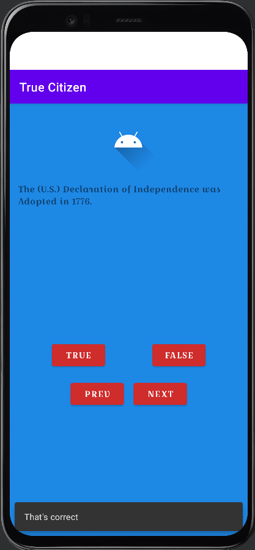

*from Paulo's [The Comprehensive 2021 Android Development Masterclass](https://www.udemy.com/course/android-development-java-android-studio-masterclass/) **Build a quiz app***

#### feature included/utilized:
- chaining buttons
- Question model, MainActivity as controller, and buttons/layouts as view
- accessing and data binding strings stored in res/string.xml
- evaluating true/false based stored value

